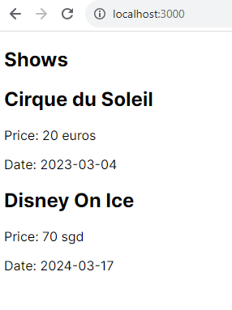
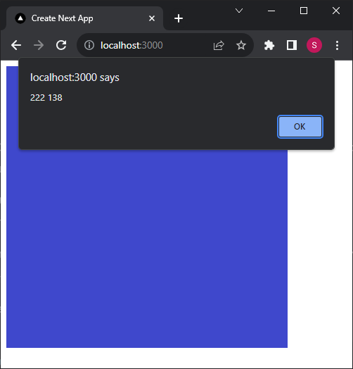

# Week 7 hands-on

We will continue working on the Next.js application `my-app` which we initialized during the previous week.

## Viewing this hands-on worksheet

To preview this hands-on worksheet in VSCode, do the following:

1. Open this file in VSCode

2. Press ctrl+shift+v to open the preview of this document

## Activity 1: Complete the implementation

Before you start working on the hands-on activities, ensure that you have done the following:

1. Open the `my-app` folder within VSCode

2. Open a terminal within the `my-app` folder and run `npm run dev` to start the development server

3. Delete the contents of `globals.css` (not the file)

4. Ensure that you leave the developer tools Console open in the browser

### Task 1: Component with props

Replace the code in `app/page.jsx` with the following code:

```jsx
// TODO complete the Show component
function Show() {
  return (
    <div>
      <h2>TODO_SHOW_NAME</h2>
      <p>Price:</p>
      <p>Date:</p>
    </div>
  );
}

// do not change the App component
export default function App() {
  const cirque_du_soleil = {
    name: "Cirque du Soleil",
    price: 20,
    currency: "euros",
    date: "2023-03-04",
  };
  const disney_on_ice = {
    name: "Disney On Ice",
    price: 70,
    currency: "sgd",
    date: "2024-03-17",
  };

  return (
    <section>
      <h1>Shows</h1>
      <Show show={cirque_du_soleil} />
      <Show show={disney_on_ice} />
    </section>
  );
}
```

Complete the `Show` component, which should take in `show` as a prop.
Hint: we can evaluate JS expressions within the component



### Task 2: Event listeners

Replace the code in `app/page.jsx` with the following code:

```jsx
"use client";
import Image from "next/image";

export default function App() {
  // TODO complete the function
  function handleClick() {
    // should show an alert with the cursor's coordinates
    const coordinates = `${-1} ${-1}`;
    alert(coordinates);
  }

  return (
    <Image
      src="data:image/png;base64,iVBORw0KGgoAAAANSUhEUgAAAGQAAABkCAYAAABw4pVUAAAABGdBTUEAALGPC/xhBQAAAAlwSFlzAAAOxAAADsQBlSsOGwAAAQNJREFUeF7t0TEBwCAQwMAvxrpWfD3BgogMd0sE5Hm/fw8Z65YIQ2IMiTEkxpAYQ2IMiTEkxpAYQ2IMiTEkxpAYQ2IMiTEkxpAYQ2IMiTEkxpAYQ2IMiTEkxpAYQ2IMiTEkxpAYQ2IMiTEkxpAYQ2IMiTEkxpAYQ2IMiTEkxpAYQ2IMiTEkxpAYQ2IMiTEkxpAYQ2IMiTEkxpAYQ2IMiTEkxpAYQ2IMiTEkxpAYQ2IMiTEkxpAYQ2IMiTEkxpAYQ2IMiTEkxpAYQ2IMiTEkxpAYQ2IMiTEkxpAYQ2IMiTEkxpAYQ2IMiTEkxpAYQ2IMiTEkxpAYQ2IMiTEkxpAYQ2IMSZk5UvQDGoVPhfIAAAAASUVORK5CYII="
      alt="indigo cube"
      width={400}
      height={400}
      // TODO add the event listener for the click event
    />
  );
}
```

Complete the `handleClick` function so that clicking on the image shows an alert with the coordinates of the mouse click.
Hint: we can get the cursor coordinates by passing an event object to our event handler.

Use `event.nativeEvent.offsetX` to get the X coordinates of the mouse click



## Activity 2: Fix the code

### Task 1

Replace the code in `app/page.jsx` with the following code:

```jsx
function App() {
  return <div>Hello world</div>;
}
```

Read the error message, and attempt to fix the error.

### Task 2

Replace the code in `app/page.jsx` with the following code:

<!-- prettier-ignore -->
```jsx
export default function Profile() {
  return
    <h1>The road not taken</h1>;
}
```

Fix the return statement, so that the <h1> element renders on the page.

### Task 3

Replace the code in `app/page.jsx` with the following code:

```jsx
function greeting() {
  return <p>Hello</p>;
}

export default function App() {
  return (
    <section>
      <greeting />
      <greeting />
      <greeting />
    </section>
  );
}
```

Read the warning message, and attempt to fix it.
Hint: How do we differentiate regular HTML elements from JSX components?

If you do not see a warning message, this happens because there was nothing rendered on the page before you pasted the code in. Try to render `<h1>Hello</h1>` in the `App` component first, before replacing the code again.

## References

Activities adapted from the following resources:

- https://react.dev/learn/your-first-component
