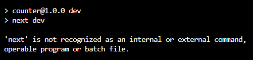
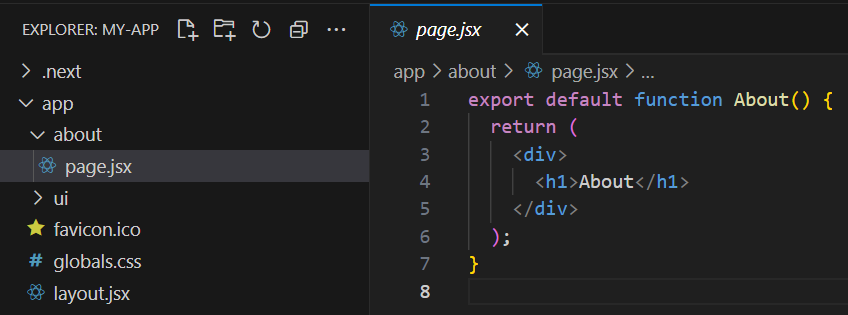
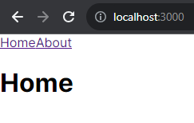
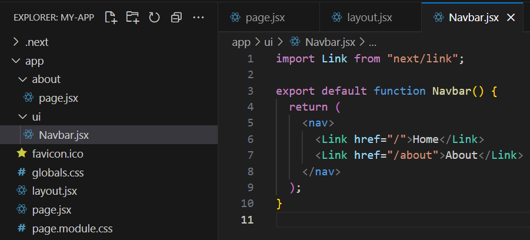
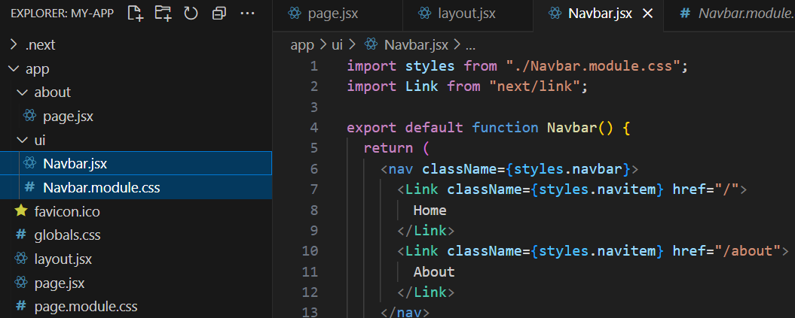
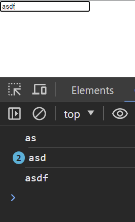
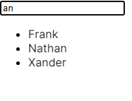
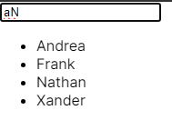

# Week 7 hands-on

## Viewing this hands-on worksheet

To preview this hands-on worksheet in VSCode, do the following:

1. Open this file in VSCode

2. Press ctrl+shift+v to open the preview of this document

## Activity 1: Complete the implementation

We will be working with the `counter` project in the hands_on folder.

### Activity prerequisites

Before you start working on the hands-on activities, ensure that you have done the following:

1. Open the `counter` folder within VSCode

2. Open a terminal within the `counter` folder and run `npm run dev` to start the development server

### Task 1: attempting to run the project

Attempt to run the command `npm run dev`.

You should see an error similar to the following:

```
> counter@1.0.0 dev
> next dev

'next' is not recognized as an internal or external command,
operable program or batch file.
```



When seeing this error, it is likely that the `package.json` script we have run contains an error.

Referencing the `scripts` property of `package.json`, we see the following script:

`"dev": "next dev",`

This corresponds to the error we saw, about `next` not being recognized.

### Task 2: resolving the error

The error happens since `next` is a program that comes from our dependencies, which has not yet been installed.

To resolve this, we need to install the required packages listed within `package.json`:

```bash
npm install
```

This will generate the `node_modules/` folder.

### Task 3: running the development server

Other than the `node_modules/` folder, the `.next/` folder is also missing.

Start the development server:

```bash
npm run dev
```

This should generate the `.next/` folder, and start the development server on `http://localhost:3000`.

### Task 4: view the app

Go to [http://localhost:3000](http://localhost:3000) and view the application.

## Activity 2: Creating a multi-page application

We will continue working on the Next.js application `my-app` which we also worked with last week.

### Activity prerequisites

Before you start working on the hands-on activities, ensure that you have done the following:

1. Open the `my-app` folder within VSCode

2. Open a terminal within the `my-app` folder and run `npm run dev` to start the development server

### Task 1: create a second page

Create a new folder `app/about/`.

Within that folder, create a `page.jsx`.

Make sure that `app/about/page.jsx` has one default export.



### Task 2: create a navbar

Next, we want to create a navigation bar at the top of our application so that we can easily switch between pages to visit.

We shall do so in `app/layout.jsx`, as we want this navbar to be shared across all our components.

Since we are using the `<Link>` component from Next.js, remember to import it.

```jsx
import Link from "next/link";

// rest of the code omitted for brevity

function Navbar() {
  return (
    <nav>
      <Link href="/">Home</Link>
      <Link href="/about">About</Link>
    </nav>
  );
}

export default function RootLayout({ children }) {
  return (
    <html lang="en">
      <body className={inter.className}>
        <Navbar />
        {children}
      </body>
    </html>
  );
}
```



### Task 3: Making the Navbar its own component

While the navbar needs to be shared across all our pages, it would be unintuitive to search for it in the root layout component whenever we wish to change it.

Let us create a new folder `ui` in the `app` folder.

We shall create our Navbar component there instead by creating a file `app/ui/Navbar.jsx`.

Since this is a component of its own, we will need a default export.



We can import this in the layout component instead.

```jsx
import Navbar from "@/app/ui/Navbar";

// other code omitted for brevity

export default function RootLayout({ children }) {
  return (
    <html lang="en">
      <body className={inter.className}>
        <Navbar />
        {children}
      </body>
    </html>
  );
}
```

Visit our page in the browser to ensure that our app still renders correctly without errors.

In general, reusable UI components will be declared in the `app/ui/` folder where possible, as the `layout.jsx` or `page.jsx` files should ideally only contain code about how to layout the page or app itself.

The convention for component's filenames is to be written in PascalCase, to indicate that they are components and not regular files.

### Task 4: Adding styles to the navbar

Next, let us add styles to the navbar component.

Create a file `app/ui/Navbar.module.css` and populate it with the following CSS:

```css
.navbar {
  background-color: #333;
  overflow: hidden;
}

.navitem {
  float: left;
  display: block;
  color: white;
  text-align: center;
  padding: 14px 16px;
  text-decoration: none;
}

.navitem:hover {
  background-color: #ddd;
  color: black;
}
```

We can import the styles into our component with an import statement.

```jsx
import styles from "./Navbar.module.css";
```

Next, we want to add the styles to the `className` attribute of each relevant component.



In general, we want to co-locate the CSS module file with our pages and components.

E.g. `page.jsx` and `page.module.css` are in the same folder, as are `Navbar.jsx` and `Navbar.module.css`

CSS module files will also be named with the same name as their JSX counterpart (except their extension ends in `.module.css`).

E.g. `Navbar.jsx` will have a CSS module `Navbar.module.css`

### Task 5: Visiting the `/ui` route

Try visiting the `/ui` route in your browser, is it a valid page? Why?

[http://localhost:3000/ui](http://localhost:3000/ui)

## Activity 3: Create an interactive search

We will continue working on the Next.js application `my-app` which we also worked with last week.

### Activity prerequisites

Before you start working on the hands-on activities, ensure that you have done the following:

1. Open the `my-app` folder within VSCode

2. Open a terminal within the `my-app` folder and run `npm run dev` to start the development server

### Task 1: Creating the template

Create a new page for this activity `app/namelist/page.jsx`.

Update your `Navbar` component from Activity 2 to include a link to this page.

```jsx
export default function App() {
  return (
    <div>
      <input />
    </div>
  );
}
```

View your page on the browser.

This should have created a page with an input element.

### Task 2: get input value

We want to add add an event listener for `keyup` to get our user's text input.

```jsx
export default function App() {
  function handleKeyUp(event) {
    const query = event.target.value;
    console.log(query);
  }
  return (
    <div>
      <input onKeyUp={handleKeyUp} />
    </div>
  );
}
```

Open the console and type something into the input field.

It should echo your input accordingly.



### Task 3: rendering a list of names

Let us add some names to be rendered as a list.

```jsx
const NAMES = [
  "Andrea",
  "Billie",
  "Clara",
  "David",
  "Eva",
  "Frank",
  "Grace",
  "Henry",
  "Ivy",
  "Jack",
  "Katherine",
  "Leo",
  "Mia",
  "Nathan",
  "Olivia",
  "Peter",
  "Quinn",
  "Rachel",
  "Samuel",
  "Taylor",
  "Ursula",
  "Victor",
  "Wendy",
  "Xander",
  "Yvonne",
  "Zachary",
];

export default function App() {
  function handleKeyUp(event) {
    const query = event.target.value;
    console.log(query);
  }
  return (
    <div>
      <input onKeyUp={handleKeyUp} />
      <ul>
        {NAMES.map((name) => {
          return <li key={name}>{name}</li>;
        })}
      </ul>
    </div>
  );
}
```

### Task 4: adding state

We can add state to our component, to store a subset of names to display on our application.

This will require us to use the `"use client"` directive in our component, since we are using a React hook.

In order to use the `useState` hook, we will need to import it from the `"react"` library.

We will also change the reference array from which we render the list of names.

```jsx
"use client";

import { useState } from "react";

// names omitted

export default function App() {
  const [filteredNames, setFilteredNames] = useState(NAMES);
  function handleKeyUp(event) {
    const query = event.target.value;
    console.log(query);
  }
  return (
    <div>
      <input onKeyUp={handleKeyUp} />
      <ul>
        {filteredNames.map((name) => {
          return <li key={name}>{name}</li>;
        })}
      </ul>
    </div>
  );
}
```

View your app on the browser and make sure that it doesn't contain any errors.

### Task 5: filtering our query

```jsx
function handleKeyUp(event) {
  const query = event.target.value;
  setFilteredNames(NAMES.filter((name) => name.includes(query)));
}
```

Try out our application, it should filter the list of names rendered below.



### (Bonus) Task 6: case sensitivity

Try making the search case insensitive.



### (Bonus) Task 7: throttle

A consideration for UX designers is to wait for a user to stop typing before updating a display.

We can wait (e.g. 200ms) for the user to stop typing, before displaying the results.

This is one of the ways which we can prevent the display from overwhelming the user with the number of changes.

Add a throttle to the event handler, so that it throttles the display update.

Hint: explore the `setTimeout` function

Hint: alternatively, lodash has a relevant function to handle this

### (Bonus) Task 8: efficient transition

Adding and removing DOM elements are actually more computational expensive and undesired if we just want to update what shows in our list.

Use CSS to hide the elements being filtered, instead of changing what the DOM renders.

Hint: `display: none;`

Hint: CSS classes can be changed conditionally

```jsx
const shouldShow = false;
function render() {
  return (
    <li className={shouldShow ? styles.show : styles.hide}>Charlie Tan</li>
  );
}
```

## Submission

Submit your `my-app` folder which should contain activites 2 and 3.

The tasks marked (bonus) are optional to submit.

Follow the submission criteria from week 7:

1. The `.next/` and `node_modules/` folder should not be included
2. Make sure to name the zip file with your class, student id, and name
3. Do not submit unnecessary files such as the powerpoint slides
