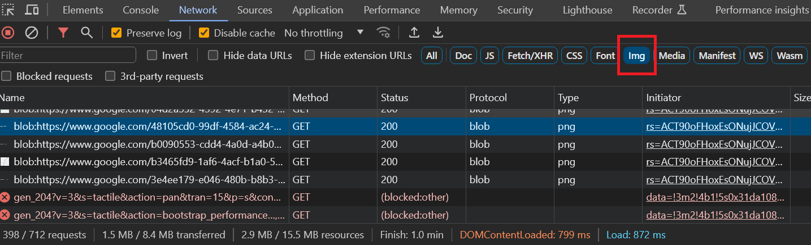
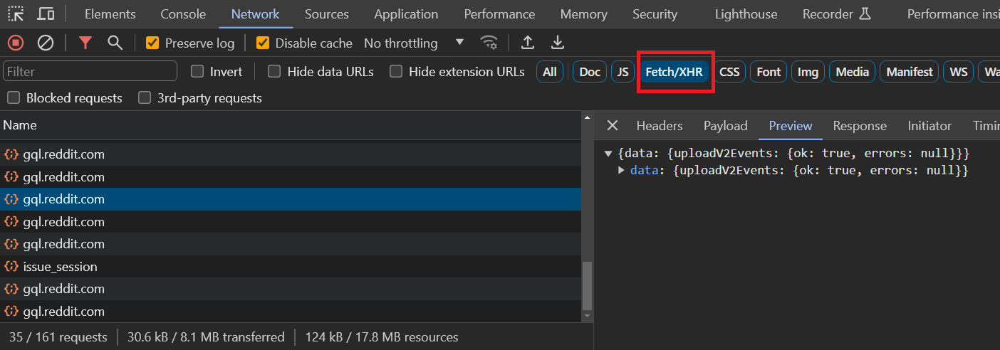

# Week 12 hands on: fetching data

## Activity 1: Viewing network activity in devtools

### Task 1: Network activity in devtools

Open the devtools and navigate to the network activity tab.

### Task 2: View the network activity for Google Maps

Visit Google Maps.

https://maps.app.goo.gl/TjDJcuFJTnfGFWBh7

**Turn on the filter for img on the network inspector.**



Scroll around the map, and see what requests are being made.

### Task 3: View network activity for Reddit

Visit https://www.reddit.com/r/Jokes/

Change the filter to Fetch/XHR instead of img on the network inspector.



Scroll to the bottom of the page, and observe the new requests that are being made as new posts are loaded.

### Task 4: View network activity for Youtube

Continue using the Fetch/XHR for this task.

Visit https://www.youtube.com/

Scroll to the bottom of the page, and observe the new requests that are being made as new videos are loaded.

### Task 5: View network activity for NP's website

Continue using the Fetch/XHR for this task.

Visit https://www.np.edu.sg/

Scroll the page, do you observe any new requests being made?

### Debrief

Not all data being returned from APIs are JSON.

The data being fetched from Reddit's API is from a GrahQL backend.

Static pages (NP's website) also do not fetch new data unlike dynamic pages.

## Activity 2: fetching with the SWR library in React

Since React has a nuanced way of maintaining state within an application, we can opt to use a library to accomplish our data fetching together with the component state management.

https://swr.vercel.app/

> Note: tasks 1 and 2 references the Getting Started section of the SWR documentation.
>
> Feel free to skip the tasks and follow the official documentation instead for a much more comprehensive overview.
>
> https://swr.vercel.app/docs/getting-started
>
> You are strongly encouraged to practice reading and following official documentation, and feel free to approach your tutor for help if you encounter any difficulty along the way.
>
> Otherwise, you can simply follow the instructions in this task for a much more concise set of instructions on what's needed for our activity.

### Task 1: Setting up

**Ensure that you are within the right folder before you do the install**

We will need to install the SWR library with NPM

```bash
npm install swr
```

### Task 2: Using SWR to fetch data

For this activity, we will be fetching data from https://freeipapi.com/

```jsx
"use client";

import useSWR from "swr";

// use vanilla fetch as fetcher
// deserialize the fetched data as json
const fetcher = (...args) => fetch(...args).then((res) => res.json());

export default function App() {
  const IP_API_URL = "https://freeipapi.com/api/json/";
  const { data, error, isLoading } = useSWR(IP_API_URL, fetcher);

  if (error) {
    return <h1>failed to load</h1>;
  }
  if (isLoading) {
    return <h1>loading...</h1>;
  }

  // render data
  return <h1>Your IP is {data.ipAddress}</h1>;
}
```

### Task 3: Fetching our IP information

https://docs.freeipapi.com/response.html

Refer to the docs to display more properties in the JSON data being returned:

1. City name
2. Continent
3. Time zone

### (Bonus) Task 4: Fetching IP information for specific IP

**(This is a lengthy task, avoid attempting this unless you are done with all the other tasks needed for submission)**

Modify the page to have an input field to allow the user to specify an API.

Modify the request to take in the user specified IP.

Hint: The IP-ADDRESS is an optional parameter, and we have chosen to omit it in our initial implementation.

https://docs.freeipapi.com/request.html

## Activity 3: Bootstrap component library

For this activity, we will be continuing off what we have built in activity 2.

https://react-bootstrap.netlify.app/

> Note: tasks 1 and 2 references the Introduction section of the React Bootstrap documentation.
>
> Feel free to skip the tasks and follow the official documentation instead for a much more comprehensive overview.
>
> https://react-bootstrap.netlify.app/docs/getting-started/introduction#installation
>
> You are strongly encouraged to practice reading and following official documentation, and feel free to approach your tutor for help if you encounter any difficulty along the way.
>
> Otherwise, you can simply follow the instructions in this task for a much more concise set of instructions on what's needed for our activity.

### Task 1: Installation

```bash
npm install react-bootstrap bootstrap
```

### Task 2: Importing bootstrap's stylesheets

At the top of `app/globals.css`, add the following:

```css
@import "bootstrap/dist/css/bootstrap.min.css";

// rest of the globals.css file (this is just a comment, you don't need to copy this...)
```

This is to import bootstrap's stylesheets, which its components require.

### Task 3: Using React Bootstrap

Since most component libraries do not support server-side rendering, we will need to add the `"use client"` directive to the top of each file which uses it.

To begin with, ensure that the `"use client"` directive is present at the top of `app/page.jsx`.

```jsx
"use client";

// rest of page.jsx
```

### Task 4: Adding a Bootstrap spinner

https://react-bootstrap.netlify.app/docs/components/spinners

When using any component, we need to first import it at the top of the file.

```jsx
// page.jsx
"use client";
import Spinner from "react-bootstrap/Spinner";

// rest of page.jsx
```

Change the `<h1>loading...</h1>` element to the Bootstrap spinner instead.

```jsx
if (isLoading) {
  return (
    <Spinner animation="border" role="status">
      <span className="visually-hidden">Loading...</span>
    </Spinner>
  );
}
```

Refresh the page to see the spinner in action when your API request is in-flight.

### Task 5: Add the Navbar

https://react-bootstrap.netlify.app/docs/components/navbar

Try adding the Navbar to the `layout.jsx` component.

Remember to add the `"use client"` directive to the top of the files when you want to use the Bootstrap components.

Instead of using `<Nav.Link>` as per their example, change them to use the `<Link>` component from Next.js that you have used in the prior weeks.

Remember to import import the `Link` component in order to use it.

```jsx
<Nav.Link href="#home">Home</Nav.Link>
// to
<Link href="/">Home</Link>
```

Ensure that all the links to the other pages in your app are working.

## (Bonus) Activity 4: Using fetch API to fetch data in React

Without using the SWR library, use only the vanilla `fetch` browser API and React's `useEffect` hook to accomplish activity 2.

## Submission

Submit your `my-app` folder which should contain activites 2 and 3.

The tasks marked (bonus) are optional to submit.

Follow the submission criteria from week 7:

1. The `.next/` and `node_modules/` folder should not be included
2. Make sure to name the zip file with your class, student id, and name
3. Do not submit unnecessary files such as the powerpoint slides
