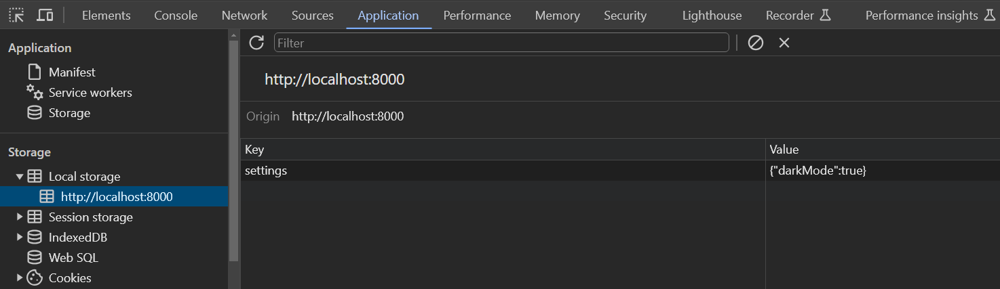
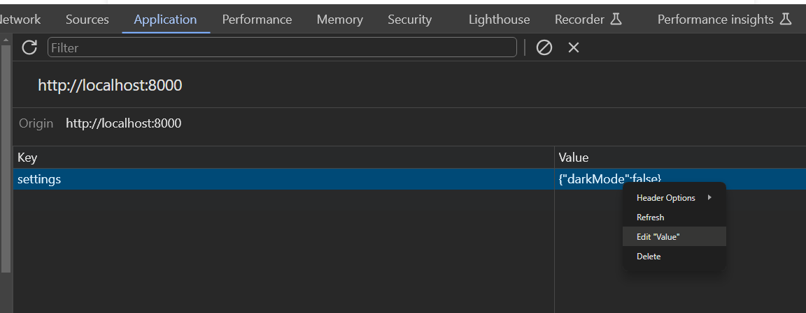
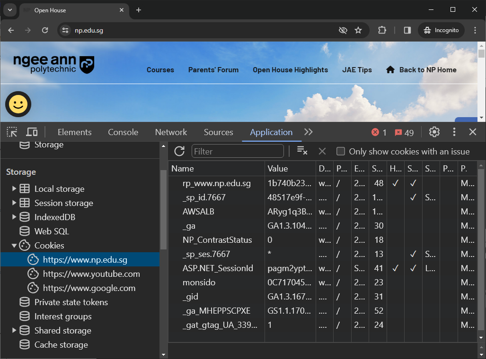
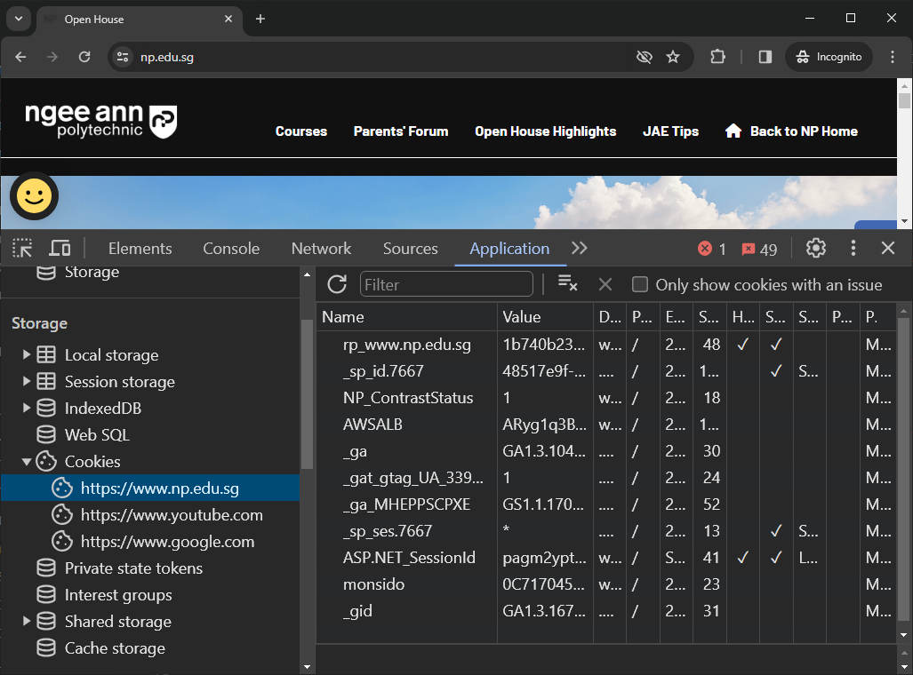

# Week 13 hands on: useEffect, storage

Start a Python http server within the `hands_on` folder to complete the first 2 activities.

```bash
python -m http.server
```

When you are done with the activities, you can kill the server with control+c.

## Activity 2: Local storage

We will be working with the following file for the activity.

`local-storage.html`

Since we are using Python's http server, we may access the page via http://localhost:8000/local-storage.html.

This application implements a dark mode view, which can be triggered by left-clicking anywhere on the page.

It starts off with light mode by default.

### Task 1: Viewing the browser storage

Open the Devtool's Application tab and select Local storage from side panel.



### Task 2: Viewing changes to the stored value

Left-click anywhere on the page, and observe how stored value changes.

### Task 3: Manually changing stored value

Manually toggle the value between either true/false.

You may do this by double right clicking on the value and selecting "edit".



Notice that the page's light/dark mode does not change when the stored value is toggled.

Try refreshing the page each time you manually modify the stored value.

Why does the page's light/dark mode not change immediately when the stored value is edited, and instead requires the page to be refreshed?

(Hint: when does JavaScript get loaded on a page? Which portion of the code has to do with loading the settings for dark mode?)

### Task 4

Put the page in dark mode, and attempt to do the following on the browser's local storage and observe if the page stays in dark mode.

- Delete the entry and refresh the page.
- Change the value of the entry to `{"darkMode": ""}` and refresh the page.
- Change the value of the entry to `{"darkMode": "false?"}` and refresh the page.

Which of the above causes the page to change to light mode, and which ones for dark mode?

## Activity 2: Session storage

We will be working with the following file for the activity.

`session-storage.html`

Since we are using Python's http server, we may access the page via http://localhost:8000/session-storage.html.

### Task 1: Populate fields

Try populating the form fields with some random data.

Delete the entry and refresh the page.

Change the value of the entry to `{}` and refresh the page. Do the form fields get populated after refreshing the page?

## Activity 3: Toggling cookie values on NP's website

Visit [NP's homepage](https://www.np.edu.sg).



You may view the cookies being stored for the current domain on Google Chrome by going to Devtool's Application tab and selecting Cookies from the side panel.



## Activity 4: useEffect

For this activity, we shall explore the use of the `useEffect` hook.

Create a page for this in your existing Next.js project, such as the `my-app` application we have been working on for the past few lessons.

```jsx
"use client";

import { useEffect, useState } from "react";

export default function App() {
  const [clicked, setClicked] = useState(false);
  useEffect(() => {
    if (clicked) {
      const timer = setTimeout(toggleButton, 2000);

      // cleanup timer
      return () => {
        clearTimeout(timer);
      };
    }
  }, [clicked]);

  function toggleButton() {
    setClicked((prev) => !prev);
  }

  return (
    <div>
      <button disabled={clicked} onClick={toggleButton}>
        {clicked ? "Paused for 2 seconds" : "Click me"}
      </button>
    </div>
  );
}
```

## Submission

Submit this hands-on worksheet. Ensure that you answer all the questions within it (they end with a question mark ?).
