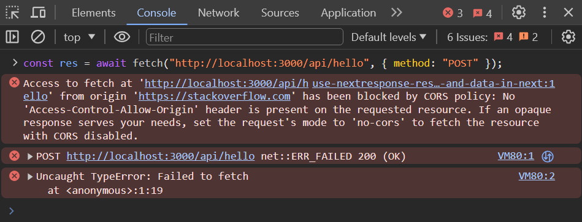

# Route handlers

React code is meant to be run on the client's browser, only intended for the frontend.

Since we are using the NextJS framework, it provides features for us to write code that runs on the backend as well.

## Creating a route handler

https://nextjs.org/docs/app/building-your-application/routing/route-handlers

Similar to the `page.jsx` file, the `route.js` file creates a special type of url for our application.

To create a route handler, we need to create a `route.js` file within the `app/` folder.

One of the conventions is to create a folder named `api/` within the `app/` folder, and use the route name as a subdirectory.

`app/api/hello/route.js`

```js
export async function GET(request) {
  // returns the string "Hello world!"
  return new Response("Hello world!");
}
```

The route above can be accessed via the url `/api/hello` through a `GET` request.

http://localhost:3000/api/hello

```jsx
// unrelated code has been omitted for brevity
// this code is only meant for illustration purposes (error handling not depicted)

export async function App() {
  // when the URL path is specified without the domain
  // requests will be made to the same origin
  const { data } = useSWR("/api/animals", fetcher);
  return <div>{data}</div>;
}
```

## Making a request to the route handler

By default, starting our application locally will host it on the domain `localhost` and on port `3000`.

To access our application, we need to visit http://localhost:3000 on our browser.

Since the `app/` folder refers to the root of our application's route, we simply append the corresponding directory paths to the `domain:port`.

The route defined above as `/api/hello` will be accessible via http://localhost:3000/api/hello.

Similarly if we create a `route.js` as follows:

`app/animals/penguin/route.js`

We will need to access the route via:

http://localhost:3000/animals/penguin

### Browser

Since the method for our route is a `GET`, we can access it by visiting the URL in our browser, apart from using JavaScript.

## Route methods

In the first example, we created and exported a function named `GET`.

We can try to change the method from `GET` to `POST`.

`app/api/hello/route.js`

```js
// this is now a POST handler, not GET
export async function POST(request) {
  return new Response("Hello world!");
}
```

Visiting http://localhost:3000/api/hello in the browser will display a 405 status code, since there is no route handler for the `GET` method.

From the browser's devtools console, you can try to make a `POST` request instead.

Ensure that your browser has already navigated to http://localhost:3000 before attempting the fetch request.

```js
const res = await fetch("http://localhost:3000/api/hello", { method: "POST" });
```

## Slugs

Suppose we had an API that sends out a greeting according to the given route:

- http://localhost:3000/api/greeting/hello
- http://localhost:3000/api/greeting/goodbye
- http://localhost:3000/api/greeting/zombies
- http://localhost:3000/api/greeting/aliens
- http://localhost:3000/api/greeting/dinosaurs

And we implemented each one of these routes separately:

`app/api/greeting/hello/route.js`

```js
export async function GET(request) {
  return new Response.json({ greeting: "hello" });
}
```

`app/api/greeting/goodbye/route.js`

```js
export async function GET(request) {
  return new Response.json({ greeting: "goodbye" });
}
```

(The rest of the example code has been omitted for brevity and sanity)

This would scale linearly and take up multiple files, growing quite unmaintainable.

### Dynamic routes

In our example above, the only thing that changes is the last word in the URL itself.

We can instead create an API route for just the greeting functionality, and access the last part in the URL which is referred to as the slug.

`app/api/greeting/route.js` (note that we have shortened our route handler path)

```js
export async function GET(request, { params }) {
  const slug = params.slug;
  return new Response.json({ greeting: slug });
}
```

The above still allows us to call our route handlers with the previously mentioned URL routes, by treating the last part of the URL as a variable.

- http://localhost:3000/api/greeting/hello
- http://localhost:3000/api/greeting/goodbye
- http://localhost:3000/api/greeting/zombies
- http://localhost:3000/api/greeting/aliens
- http://localhost:3000/api/greeting/dinosaurs

## URL parameters

Another way we can pass data from client to the server via a HTTP request is through URL parameters.

- https://www.youtube.com/watch?v=cPCLFtxpadE
- https://www.youtube.com/watch?v=4EQkYVtE-28
- https://www.youtube.com/watch?v=XmRYYrVH_zI

URL parameters can be identified based on the URL syntax, where anything that follows the `?` symbol after the path is a URL parameter.

In the path

http://localhost:3000/api/greeting?message=hello

This contains a single URL parameter with the key of `message` and the value `hello`.

### Multiple URL parameters

If there are multiple URL parameters, they need to be separated with an ampersand `&`.

http://localhost:3000/api/greeting?message=hello&name=charlie&size=smol

The URL above has the following key-value pairs.

| key     | value   |
| ------- | ------- |
| message | hello   |
| name    | charlie |
| size    | smol    |

Take note that only the start of the URL parameter needs to be demarcated with a `?`, and the rest should be separated with a different symbol `&`.

## CORS

Visit another webpage (e.g. NP's webpage), and open the browser's devtools console.

Attempt to repeat the fetch request to our own localhost.

```js
const res = await fetch("http://localhost:3000/api/hello", { method: "POST" });
```

However, this should result in a CORS error.



### Understanding CORS

Cross-Origin Resource Sharing (CORS) is a server side mechanism which is used to explicitly define which domains should be allowed to make a request for its resources.

When the browser requests for a resource, it checks what domain it is currently on, and what domain does it need to access to retrieve a resource.

A resource can either exist on the same domain, or a different domain (cross domain).

If the browser is on `np.edu.sg` and the page requests for a resource on `np.edu.sg/assets/css/main.css`, this is an example of requesting for a resource from the same domain, and it can do so without any restrictions.

On the other hand, `np.edu.sg` will also request for a resource from `fonts.googleapis.com/css2?family=Barlow` which is an example of a cross origin request. In this case, it will need to check the server's cross origin policy before requesting for a resource.

In the case of `fonts.googleapis.com`, it comes it a CORS header that allows all origins, so `np.edu.sg` is able to request for its resource without any issues.

A visual depiction of this is referenced from the MDN documentation.


https://developer.mozilla.org/en-US/docs/Web/HTTP/CORS

### Understanding the CORS error

The CORS error can occur when a server does not have the requester's origin URL listed in the allowed CORS domains.


In our example, the server running on `localhost` has not listed `stackoverflow.com` as a CORS domain.

As such, the browser chooses to abort the request by raising an error, and reporting that it is unable to perform the request due to CORS restrictions.

### Working with CORS

The CORS restriction is implemented by our browser as a security feature, and we should not be trying to work against it by disabling it.

To work around the CORS restriction, a possible solution is to set up a route handler to proxy the request for us.

Since the route handler creates a URL path on the same domain, we can change the frontend to use this URL path instead.

This effectively circumvents the CORS restriction since we are now making a request over the same origin.

`app/page.jsx`

```jsx
// unrelated code has been omitted for brevity
// this code is only meant for illustration purposes (error handling not depicted)

export default function App() {
  // when the URL path is specified without the domain, requests will be made to the same origin
  const { data } = useSWR("/api/dictionary", fetcher);
  return <div>{data}</div>;
}
```

`app/api/dictionary/route.js`

```js
export async function GET(req) {
  const res = await fetch(URL);
  const data = await res.json();

  return Response.json(data);
}
```

## API keys

When calling external APIs, some of them require some form of authentication to use their service.

A common way to accomplish this is through the use of API keys, which is a unique string generated for each user of the service.

However, it is generally not a good idea to expose the API key on the client side. Services like Google will allow the API key to be restricted to particular domains (whitelisting), but most APIs do not employ such practices.

### Hiding your API key

The API key can be hidden by relegating it to the route handler instead.

In Next.js, sensitive information such as API keys should be stored in the `.env.*` (such as the `.env.local`) file, which will be loaded into and accessible through the environment variables.

This file is usually specified in the `.gitignore` file so that credentials are not committed to the codebase.

`.env.local`

```
SENSITIVE_API_KEY=4NU4F
```

`app/api/animals/route.js`

```js
export async function GET(req) {
  const res = await fetch(URL, {
    headers: {
      AccountKey: process.env.SENSITIVE_API_KEY,
    },
  });
  const data = await res.json();

  return Response.json(data);
}
```

`app/animals/page.jsx`

```jsx
// unrelated code has been omitted for brevity
// this code is only meant for illustration purposes (error handling not depicted)

export default function App() {
  // when the URL path is specified without the domain, requests will be made to the same origin
  const { data } = useSWR("/api/animals", fetcher);
  return <div>{data}</div>;
}
```

### Google maps

Since Google APIs allow domain whitelisting, the API key for Google Maps is often embedded in the page's source itself.

However, you should ensure that you whitelist your own domains so that others do not misuse your API key.

# Appendix

## Troubleshooting

When troubleshooting route handlers, it is important to first check the devtools network inspector to see if the requests are being made correctly.

If you see that the server responds with an error, it is worth opening the console where you ran `npm run dev` to check if any errors are shown there.

## Caching

The result from the route handlers are cached by default when using the GET method with the Response object.

https://nextjs.org/docs/app/building-your-application/routing/route-handlers#behavior

## Resolving CORS on the server side

Another possible solution to overcome the CORS error is to add the CORS headers on the server side.

However, take note that this requires you to have control of the server which is unrealistic if you are depending on things such as an external API service.

## Reading the body from the request

```js
export async function POST(request) {
  const body = request.body;
}
```

Depending on the type of the body that was sent, we may need to handle the parsing differently.

```js
export async function POST(request) {
  const jsonData = JSON.parse(request.body);
  // this can be done with the following shorthand method instead
  const jsonDataShorthand = request.json();
}
```

Do note that the 2 methods listed above will result in the body being parsed as a JavaScript object.

## Route resolution

Take note that the `route.js` file cannot exist in the same directory as the `page.jsx` file.

https://nextjs.org/docs/app/building-your-application/routing/route-handlers#route-resolution

## Is this still client-side scripting?

Evidently not, and I'm not a fan of module name anyway...
